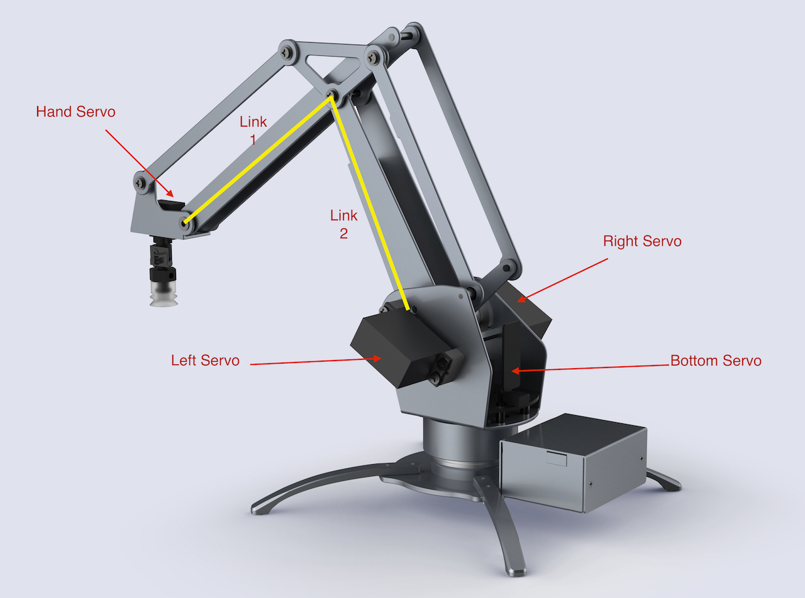
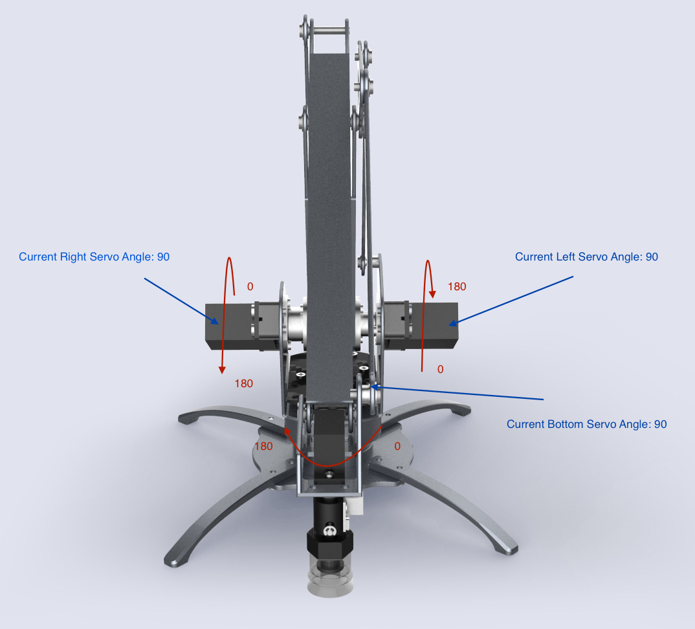
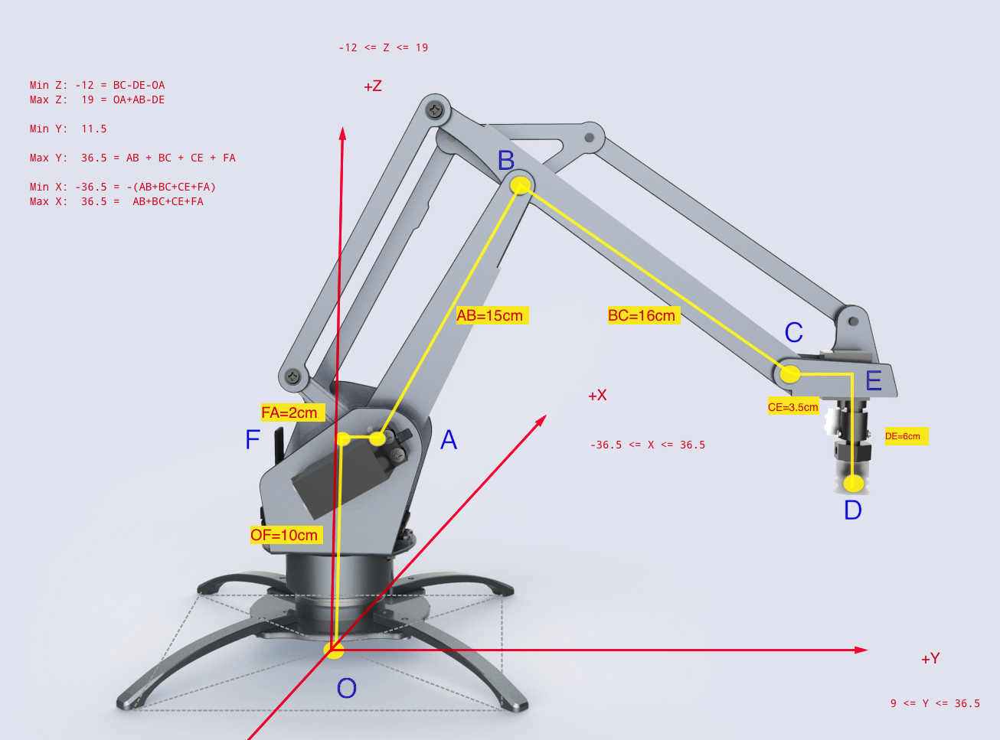
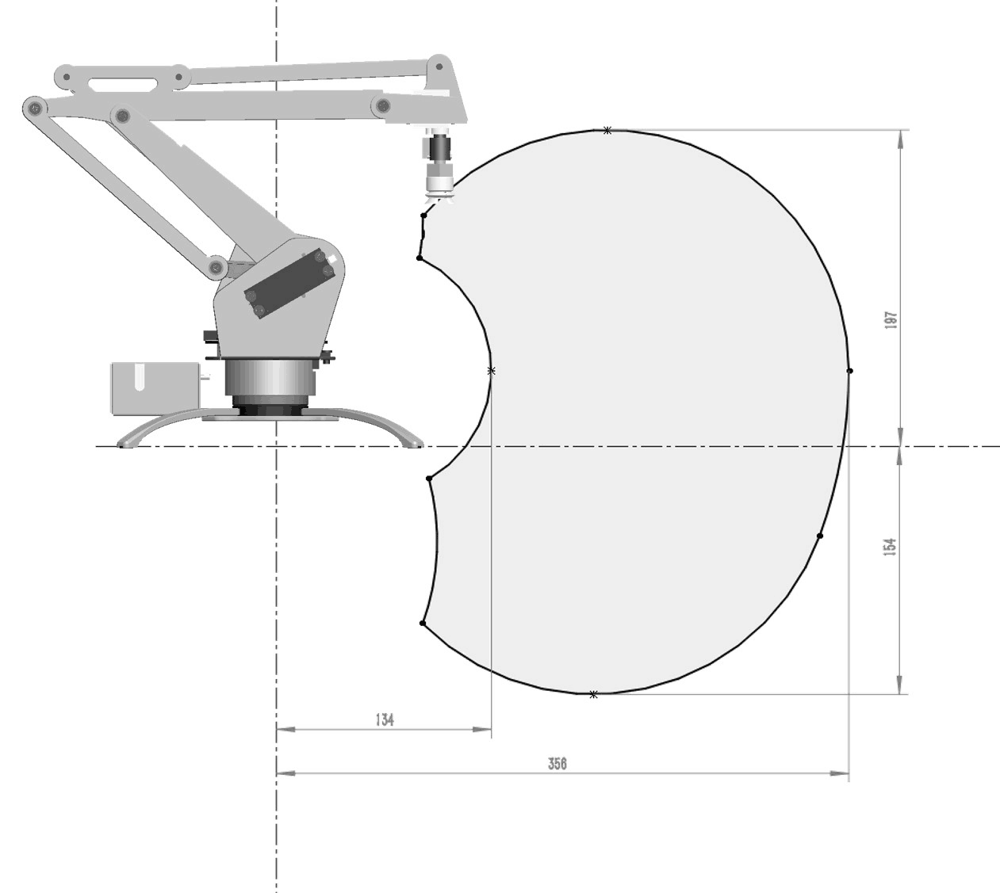

# 开发者指南 Developer Instruction

## uArm 基本知识讲解
如果你刷的是我们的通用固件，通用固件里面包含了 uArm Library 和 uArm Protocol 通信协议。  
uArm 在通电以后：  

1. 会读取当前的角度，然后 attach 所有电机。  
    *如果 uArm 没有校正，它会发出一声长鸣，要求你进行校正。你可以使用我们的开发者工具 `uarm-calibrate` 进行校正。*  

2. 然后 uArm 就自动进入准备状态，如果这个时候你发送了指令（uArmProtocol 协议），uArm 自动进行解析，并执行相应的动作。（你可以自行参照通信协议与 uArm 通信，但这不是推荐的做法）  

3. 我们更推荐的方式是使用我们已经封装好的 API 接口，你无需去理解复杂的协议，也无需要学习串口编程，上手即可使用。  

4. 在你开始任何项目之前，请认真阅读以下的指南，不保证能解决你所遇到的问题，但可使你有一些基本的认识。

## 机械运动 Mechanical Motion

### 电机示意图
uArm 是通过 4 个电机实现运动，如下图所示：  

<center>图 1.0 电机示意图</center>

- Servo 0 - Bottom Servo  
对应 Arduino PWM PIN D11, Analog PIN 2  
这个电机控制 uArm 的地盘旋转  

- Servo 1 - Left Servo  
对应 Arduino PWM PIN D13, Analog PIN 0  

- Servo 2 - Right Servo  
对应 Arduino PWM PIN D12, Analog PIN 1  
这两个电机控制 uArm 的前臂 `Link1` 与后臂 `Link2` 的运动  

- Servo 3 - Hand Servo  
对应的 Arduino PWM PIN D10, Analog PIN 3  
这个小电机控制 uArm 前端，吸头 (Suction cup) 的角度旋转

### 电机  

说到电机的控制，就要提到 Arduino, 众所周知，uArm 是开源的机械臂，这得益于 Arduino 的开源，我们可以很方便的使用成千上万的开源库，而我们选用的电机可以支持 Arduino 的 servo.h 库。

#### 电机 Attach Detach

在使用电机前，都必须对电机进行 attach, 此时电机会锁住。（默认的 Arduino 里面…… TODO）

#### 电机的转动范围

我们的电机使用默认的 `servoWrite()` 函数，每个电机的操作单位是度，范围从 `0` 度到 `180` 度。在装配的时候，是依照固定的度数把电机安装到机械臂上。
下图是机械臂默认的安装度数：  

<center> 1.1 电机角度图 </center>

- Servo 0 是 90 度，它处与中间位置  
- Servo 1 和 Servo 2 都是处于 90 度的位置  
- Servo 3 也是处于 90 度位置

虽然电机活动范围是从 0 到 180 度，但由于机械结构限制，左右电机实际活动范围将小于此。

下图是左右电机的活动范围（单独一个电机运动时）。左边大概是 150 度到 0 度的范围，右边大概是 20 度到 150 度的范围：  
左右电机转动范围

底部的电机，和前端的电机都是 0 到 180 度，比较简单。如下图：  
底部电机，与前端电机的转动范围

但是左右的电机联动的时候，两个联动的活动范围是一个下图这样的面积：  
左右电机运动范围图

通过以上的内容，你就可以直接通过各个电机的角度去控制机械臂的运动，但是这很不直观，也很 **危险**，因为左右电机的联动互相锁死，很容易把电机 `烧毁`。所以我们建立一个三维坐标系，详情请参照后面的：三维坐标系

### 读取电机角度
我们的使用的电机，内置了 ADC （模拟数字转换器），可以把当前的角度模拟信号转换成数字，Arduino 已经默认内置了 `analogRead()` 函数，读出来的数值，通过这个公式可以得出当前的角度，`intercept + analog * slope`, intercept 与 slope 的涵义，在后面的 **校正** 中详细说明。

### 校正

###### 为什么需要校正？
1. 首先，ADC 采样的 Analog 数据是有偏差的，每个电机的偏差都不一样，所以我们需要对每个电机做一次线性度的校验。

    - 我们现在的做法是让电机走到目标位置，并通过 ADC 收集 5 次 Analog 的平均值，通常采点都在 100 个点以上（TODO: 5 跟 100 分别是？）
    - 然后把收集的数据，做一个线性运算，得出 `intercept` 和 `slope` 的值

2. 其次，一般我们都会以固定角度把电机安装到机械臂上。就如 电机控制里图 2 一样，但所有的机械臂都是人工装配，所以会有人工装配误差。这个误差也需要用人手去测量。

###### 如何校正
在开发者工具的 section 会专门介绍校正的工具。

### 三维坐标系

直接控制全部电机的转动，可以很直接的控制 uArm 的运动，但是很不直观，也很危险。所以我们建立一个三维坐标系 (x, y, z), 以 `厘米` 为单位：  

<center>图 1.2 坐标系示意图</center>

上图详细标注了 uArm 的六个连接点 (O, A, B, C, D, E), 6 个连接线 (OF, AF, AB, BC, CD, DE) 之间的长度，及 X, Y, Z 取值范围。(FIXME: Max Z = OF + AB - DE, not OA)

#### 连接点：  
- O 原点 也就是 (0, 0, 0)
- A （左右）电机的轴心中间的那个点
- B 连接前后臂的螺丝位置（准确说是两个螺丝的中间点）
- C 连接前臂与前端的螺丝位置 （同上）
- D 吸头底部的中间点
- E 点是虚构的点，是 C 的平行线与 E 的垂直线的交点
- F 点是虚构的点，是 O 的垂直线与 A 的平行线的交点

#### 连接线
- OF = 10 cm  原点到左右轴中心的高度
- AF = 2 cm   左右轴中心与原点垂直线的距离
- AB = 14.8 cm  后臂长
- BC = 16 cm  前臂长
- CE = 3.5 cm 前端长
- DE = 6 cm   吸头高度

#### 极限值

- X 的范围： -36.5cm ~ 36.5cm  
    Max X =  AB + BC + CD + AF  

- Y 的范围： 11.5cm ~ 36.5cm  
    Max Y = Max X  
    MIN Y = 

- Z 的范围： -12cm ~ 19cm  
    Max Z = OA + AB - DE  
    Min Z = BC - DE - OA

#### 活动范围

X, Y, Z 的活动范围会相互制约，上面的极限值并不能真实反映出 uArm 的活动范围。uArm 实际活动范围是一个不规则的范围，见下图。有些不能达的目标点很危险，我们默认会对不能到达的地方做一些限制，并返回一个错误码。（并且我们提供了一个可以检查这个点能不能到达的函数 - Todo）


<center>图 1.3 坐标系示意图</center>

#### 精准度与偏差

理论误差 `±0.5 厘米`, 也就是 `1 厘米` 的误差，但实际上跟范围和负载有关系。

电机在 `40` 度到 `140` 度之间，误差比较小，但是在小于 `40` 和大于 `140` 度的时候，误差会变得比较大，
下面是电机 0 到 180 度之间的 target 走位，与实际走位：  
<1.4 误差图表>

下图是用电机在这个范围内，误差较小的范围：  
<1.5 一个是俯视图，一个侧视图，呈现，所有的电机在 40 度至 140 度之间的范围>  

## uArm 套件的使用

接下来开始讲解附带的一些开发工具。  

我们的 uArm 套件都是用 Python 写的，目的是帮助用户快速开发。

### 安装教程

首先你需要安装 uArm 的运行环境：

#### Windows

- 由于 Windows 没有内置 Python 环境，如果你需要使用这些开发套件，你必须先安装 Python 环境：[Python Environment][python-download-link]  
- 然后你需要安装 `pip`, 这里推荐：[pip-for-windows][pip-for-windows-link]
- 装完 pip 以后，你就可以通过以下命令 `pip install pyuarm` 安装 uArm 的套件


  [python-download-link]: https://www.python.org/downloads/ "PythonDownloadLink"
  [pip-for-windows-link]: https://sites.google.com/site/pydatalog/python/pip-for-windows "pip-for-windows"

#### Mac

需要：  
- pip  
- avrdude  

推荐使用我们所提供的一键安装命令：

```
    bash -c "$(curl -fsSL http://download.ufactory.cc/tools/macosx/install.sh)"
```

这个命令会帮你安装所有需要用到的运行环境，十分便捷。  


如果你希望自己安装，你也按照下面的步骤安装：  

- 首先安装 pip: `sudo easy_install pip`  
- 然后安装 pyuarm: `pip install pyuarm`  
- 如果你需要固件升级固件，你还要需要安装 `avrdude`, 一个最方便的方法是安装：[Homebrew][Homebrew-link]  
- 安装完 homebrew, 以后你就可以直接用：`brew install avrdude`  

  [Homebrew-link]: http://brew.sh "Homebrew"

#### Linux

需要：  
- pip  
- avrdude  

Linux 下可以使用发行版里面的安装工具安装，例如在 Debain 下你可以直接使用：
```
sudo apt-get install python-pip python-dev build-essential avrdude  
```
安装完以后，你就可以使用 `pip install pyuarm` 安装套件。  

#### 使用教程

当你安装了所有的套件以后，你就可以使用一下套件：  

- uarm-firmware 更新固件，查看固件
- uarm-calibrate 校正 uArm
- uarm-listport 检查当前可用的 uArm 端口
- uarm-miniconsole 一个纯命令行的简单控制端软件 (To-Do)

